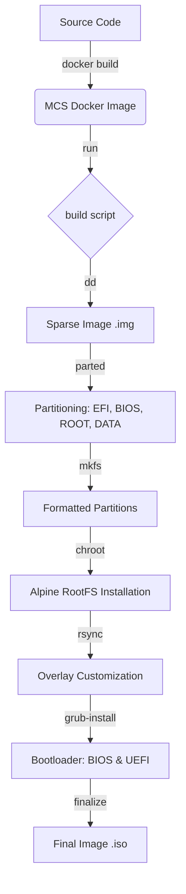

# Migasfree Clone System (MCS)

[](VERSION)

**Migasfree Clone System (MCS)** is a lightweight, Alpine Linux-based utility designed for rapid system imaging and cloning. It provides a simple Text User Interface (TUI) to manage, download, and deploy system images across BIOS and UEFI environments.

---

## 📚 Documentation

- [Architecture & Design](docs/architecture.md)
- [Configuration Guide](docs/configuration.md)
- [Shell Functions Reference](docs/functions.md)
- [Testing with QEMU](docs/testing.md)
- [Deployment to USB](docs/usb_deployment.md)
- [Image Management & Pool](docs/images_management.md)

---

## 🚀 Quick Start

### Prerequisites

- A Linux host (preferably Debian/Ubuntu based).
- **Docker** installed and running.
- **Root privileges** (required for loop device manipulation and partitioning).
- `parted`, `e2fsprogs`, and `qemu-utils` installed on the host.

### Building the Image

To generate the MCS bootable image, simply run the build script from the root of the repository:

```bash
sudo ./build
```

The script will:

1. Build the MCS Docker image.
2. Create a sparse disk image in the `artifacts/` directory.
3. Partition and format the image.
4. Install the MCS system and GRUB (BIOS/UEFI) inside the image.
5. Finalize the image as a bootable **.iso** file.

The resulting image will be located at `artifacts/mcs-<version>.iso`.

---

## 🏗️ Architecture

The MCS build process follows a multi-stage approach to ensure a clean and reproducible environment.



### Key Components

| Component | Path | Description |
| :--- | :--- | :--- |
| **Build Script** | `/build` | Orchestrates the image creation process on the host. |
| **MakeImg** | `/defaults/usr/bin/makeimg` | The main logic running inside the container to build the OS. |
| **Overlay** | `/defaults/overlay/` | Files and configurations injected into the target system. |
| **MCS Menu** | `.../usr/share/mcs/menu.sh` | The TUI application that users interact with upon booting. |

---

## ⚙️ Configuration

The system behavior can be customized via environment variables in the `build` script or through the `/mcsdata/config.yml` file in the generated image.

### Build Variables

| Variable | Default | Description |
| :--- | :--- | :--- |
| `MCS_VERSION` | *(from VERSION)* | Version tag for the image. |
| `MCS_SIZE_MB` | `3072` | Total size of the generated sparse image. |
| `SERVER_URL` | `inv.org` | Default image server URL. |
| `KEYMAP` | `es` | Default keyboard layout. |
| `TEST_UEFI` | `false` | Enable UEFI mode in QEMU testing. |
| `TEST_RAM` | `2G` | RAM allocated for the testing VM. |

---

## 🖥️ Usage

Once the image is built, you can write it to a USB drive or boot it in a Virtual Machine (QEMU/KVM).

### Booting in QEMU (for testing)

```bash
qemu-system-x86_64 -m 2G -drive file=artifacts/mcs-testing.iso,format=raw -enable-kvm
```

### Main Menu Options

1. **Clone from Network**: Stream a project directory (SYSTEM.raw/DATA.raw) directly from the remote server to the local disk using high-speed RAW partition streaming ("Turbo Clone").
2. **Clone from USB**: Select a project directory already stored in the USB's data partition (`MCS_DATA`) and clone it to the destination disk using `dd`.
3. **Local Images**: List, download, or delete system projects (directories) to/from the USB's storage.
4. **Settings**: Configure the server URL and keyboard layout.
5. **Poweroff**: Safely shut down the system.
