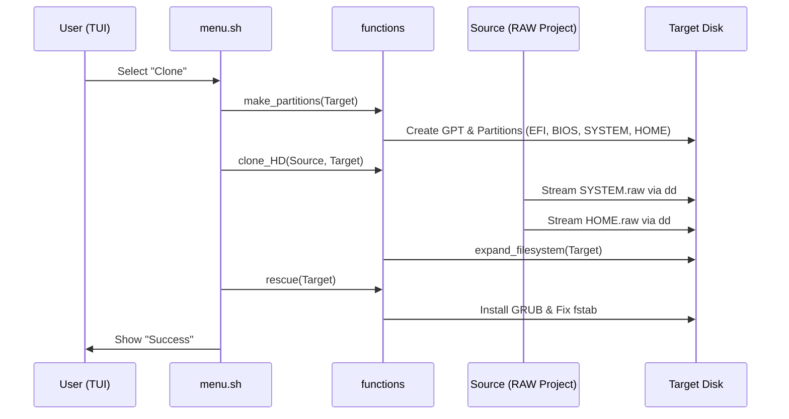

# Architecture & Technical Deep Dive

The **Migasfree Clone System (MCS)** is designed as a specialized live environment for system deployment. This document explains the internal structure, partitioning schemes, and the image generation workflow.

## 💾 Partitioning Scheme

The MCS bootable image uses a GPT partition table with support for both legacy BIOS and modern UEFI booting.

### MCS Image Structure (The "USB" Image)

When the `build` script runs, it creates a 3GB (default) image with the following partitions:

| Partition | Label | Filesystem | Size | Purpose |
| :--- | :--- | :--- | :--- | :--- |
| 1 | `MCS_EFI` | vfat | 100MB | EFI System Partition (ESP) for UEFI boot. |
| 2 | - | - | 1MB | BIOS Boot Partition for GRUB on GPT/BIOS. |
| 3 | `MCS_ROOT` | ext4 | 2GB | The Alpine Linux root filesystem. |
| 4 | `MCS_DATA` | ext4 | ~1GB | Data partition for images and configurations. |

### Target System Scheme (Defined in `functions`)

The `functions` library defines a default layout for target systems (clones):

- **EFI**: 512MB (vfat)
- **BIOS**: 1MB
- **SWAP**: 4GB
- **SYSTEM**: 20GB (ext4)
- **HOME**: Variable (ext4)

## 🛠️ Build Workflow

The build process is containerized to ensure all dependencies (`parted`, `grub`) are consistent.

1. **Host Orchestration (`/scripts/build.sh`)**:
   - Prepares a sparse file.
   - Sets up a loop device on the host.
   - Triggers the Docker container with privileged access.

2. **Image Construction (`/defaults/usr/bin/makeimg`)**:
   - Downloads the Alpine MiniRootFS.
   - Installs necessary packages via `apk`.
   - Injects the `/overlay` files.
   - Configures the bootloader (GRUB) for both targets.
   - Finalizes by renaming the raw `.img` file to a bootable `.iso` format for broader compatibility with flashing tools.

MCS uses a **block-level streaming approach** using `dd` for maximum performance. This "Turbo Clone" mechanism directly pipes the RAW partition files (`SYSTEM.raw`, `HOME.raw`) from the source to the target partitions.

- **Efficiency**: Since RAW images are shrunk to their minimum size during construction to save bandwidth, MCS automatically **expands the filesystem** to fill the target partition using `resize2fs` after cloning.
- **Speed**: Network deployment reaches the maximum bandwidth available (100MB/s+ on Gigabit networks).
- **Simplicity**: No complex mounting (NBD) or file-level synchronization is required.
- **Reliability**: Block-level copies ensure the exact state of the source system, including complex permissions and special files.

### Sequence Diagram: Cloning Process



## 📁 Server Project Structure

Project images are served via HTTP. Each project is a directory on the server containing the raw partition images and metadata.

### Directory Layout

```text
http://<SERVER>/pool/mcs/
├── ubuntu-22-04/
│   ├── partition.yml          # Partition scheme (mandatory)
│   ├── checksums.sha256       # Integrity hashes (optional)
│   ├── SYSTEM.raw             # Root filesystem image
│   └── HOME.raw               # User data partition image
├── windows-10/
│   ├── partition.yml
│   ├── checksums.sha256
│   ├── SYSTEM.raw
│   └── HOME.raw
└── projects.json              # Project index (mandatory)
```

### `projects.json`

This file indexes all available projects on the server. MCS fetches it instead of parsing the server's directory listing.

**Format:**

```json
[
  {"name": "ubuntu-22-04",  "enabled": true,  "description": "Ubuntu 22.04 LTS"},
  {"name": "windows-10",    "enabled": true,  "description": "Windows 10 Enterprise"},
  {"name": "centos-7",      "enabled": false, "description": "CentOS 7 (discontinued)"}
]
```

| Field | Type | Default | Description |
| :--- | :--- | :--- | :--- |
| `name` | string | — | Project directory name. Must match the directory on the server. |
| `enabled` | boolean | `true` | Controls visibility in MCS. When `false`, the project is not listed in the cloning menus. Useful for deactivating projects without removing files. |
| `description` | string | `""` | Human-readable description shown alongside the project name in cloning menus. |

If the `enabled` field is omitted, the project is shown by default. Only items with `enabled: false` are filtered out.

### `partition.yml`

Each project directory must contain a `partition.yml` describing its partition layout. Example:

```yaml
partitions:
  - number: 1
    name: EFI
    size: 512
    filesystem: vfat
    mount: /boot/efi
    type: C12A7328-F81F-11D2-BA4B-00A0C93EC93B
  - number: 2
    name: BIOS
    size: 1
    type: 21686148-6449-6E6F-744E-656564454649
  - number: 3
    name: SYSTEM
    size: 20480
    filesystem: ext4
    mount: /
    type: EBD0A0A2-B9E5-4433-87C0-68B6B72699C7
  - number: 4
    name: HOME
    size: 0
    filesystem: ext4
    mount: /home
    type: EBD0A0A2-B9E5-4433-87C0-68B6B72699C7
```

Size is in MB. A size of `0` means the partition uses the remaining disk space.

## 🌐 Networking

MCS is configured to use DHCP on all interfaces by default. Upon boot, it attempts to:

1. Initialize networking.
2. Get an IP address via DHCP.
3. Check connectivity to the `SERVER_URL`.
4. Update system certificates to allow secure image downloads via HTTPS.

## 🐧 Shell Compatibility & Tooling

MCS runs on **Alpine Linux**, which by default uses **BusyBox** for many common shell utilities. However, to ensure reliability and support advanced features (like JSON parsing and block device management), MCS explicitly includes and requires the full GNU/util-linux versions of key tools.

### Key Tooling Requirements

- **Shell**: `bash` (required for arrays, advanced parameter expansion, and process substitution).
- **Block Management**: `lsblk`, `partx`, `sfdisk`, and `parted` from the **util-linux** and **parted** packages.
  - *Why?* BusyBox versions of these tools often lack support for GPT, JSON output (`-J`), or specific flags like `-o` (output columns).
- **Data Transfer**: `dd` and `pv`.
  - *Why?* `pv` is used for progress monitoring since BusyBox `dd` does not support `status=progress`.
- **Parsing**: `jq` and `yq`.
  - *Why?* Essential for robust parsing of `lsblk -J` and `partition.yml` metadata.
- **Networking**: `wget` (from the full `wget` package, not BusyBox).
  - *Why?* Better support for timeouts and HTTPS.

### BusyBox vs. GNU/Full Utilities

When developing or modifying MCS scripts, follow these guidelines:

1. **Prefer Posix**: Use `sh` compatible syntax where possible, but `bash` is the target shell.
2. **Avoid BusyBox-only hacks**: Assume the presence of full `util-linux` tools.
3. **Regex**: Avoid `grep -P` (PCRE) as it is not guaranteed to be present; use `grep -E` (Extended Regex).
4. **Sed**: Use `sed -i` for in-place editing, as the full version installed in MCS supports it consistently.
5. **Progress**: Always pipe through `pv` for long-running operations instead of relying on `dd` progress flags.
