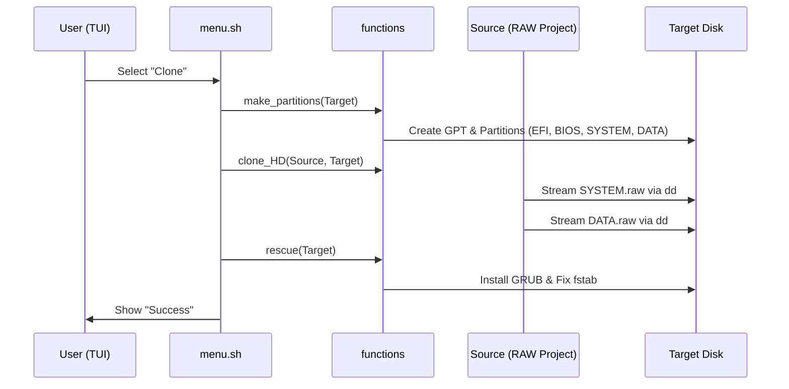

# Architecture & Technical Deep Dive

The **Migasfree Clone System (MCS)** is designed as a specialized live environment for system deployment. This document explains the internal structure, partitioning schemes, and the image generation workflow.

## 💾 Partitioning Scheme

The MCS bootable image uses a GPT partition table with support for both legacy BIOS and modern UEFI booting.

### MCS Image Structure (The "USB" Image)

When the `build` script runs, it creates a 3GB (default) image with the following partitions:

| Partition | Label | Filesystem | Size | Purpose |
| :--- | :--- | :--- | :--- | :--- |
| 1 | `MCS_EFI` | vfat | 100MB | EFI System Partition (ESP) for UEFI boot. |
| 2 | - | - | 1MB | BIOS Boot Partition for GRUB on GPT/BIOS. |
| 3 | `MCS_ROOT` | ext4 | 2GB | The Alpine Linux root filesystem. |
| 4 | `MCS_DATA` | ext4 | ~1GB | Data partition for images and configurations. |

### Target System Scheme (Defined in `functions`)

The `functions` library defines a default layout for target systems (clones):

- **EFI**: 512MB (vfat)
- **BIOS**: 1MB
- **SWAP**: 4GB
- **SYSTEM**: 20GB (ext4)
- **HOME**: Variable (ext4)

## 🛠️ Build Workflow

The build process is containerized to ensure all dependencies (`parted`, `grub`, `rsync`) are consistent.

1. **Host Orchestration (`/scripts/build.sh`)**:
   - Prepares a sparse file.
   - Sets up a loop device on the host.
   - Triggers the Docker container with privileged access.

2. **Image Construction (`/defaults/usr/bin/makeimg`)**:
   - Downloads the Alpine MiniRootFS.
   - Installs necessary packages via `apk`.
   - Injects the `/overlay` files.
   - Configures the bootloader (GRUB) for both targets.
   - Finalizes by renaming the raw `.img` file to a bootable `.iso` format for broader compatibility with flashing tools.

MCS uses a **block-level streaming approach** using `dd` for maximum performance. This "Turbo Clone" mechanism directly pipes the RAW partition files (`SYSTEM.raw`, `DATA.raw`) from the source to the target partitions.

- **Speed**: Network deployment reaches the maximum bandwidth available (100MB/s+ on Gigabit networks).
- **Simplicity**: No complex mounting (NBD) or file-level synchronization is required.
- **Reliability**: Block-level copies ensure the exact state of the source system, including complex permissions and special files.

### Sequence Diagram: Cloning Process

## 🌐 Networking

MCS is configured to use DHCP on all interfaces by default. Upon boot, it attempts to:

1. Initialize networking.
2. Get an IP address via DHCP.
3. Check connectivity to the `SERVER_URL`.
4. Update system certificates to allow secure image downloads via HTTPS.
