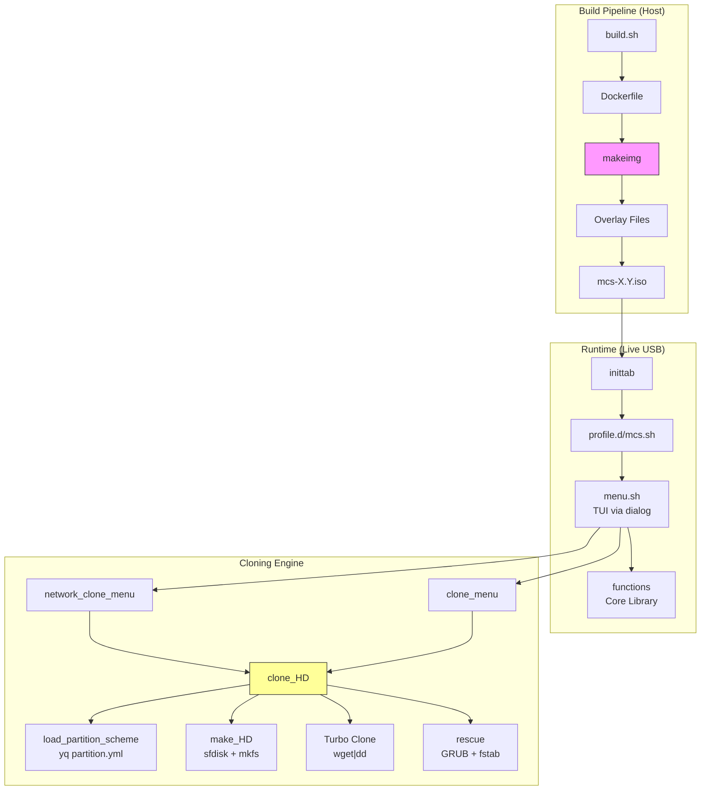

# Informe de Auditoría de Código — MCS v1.1

**Rol revisor**: Technical Lead & Architect
**Fecha**: 2026-05-05
**Última actualización**: 2026-05-05
**Alcance**: Auditoría estática completa del código fuente (1860 líneas en 7 archivos principales).
**Marco**: STRIDE (Spoofing, Tampering, Repudiation, Info Disclosure, DoS, Elevation of Privilege) + ADR.

---

## 1. Resumen Ejecutivo

El código de MCS está estructurado en 7 archivos con ~1860 líneas totales:

| Archivo | Líneas | Rol |
| :--- | :--- | :--- |
| `functions` | 850 | Librería core (disk, clone, rescue) |
| `menu.sh` | 508 | TUI via `dialog` |
| `build.sh` | 70 | Orquestación del build (host) |
| `test.sh` | 117 | Script de testing QEMU |
| `test-boot.sh` | 47 | Verificación de arranque post-clon |
| `makeusb.sh` | 146 | Escritura de USB físico |
| `makeimg` | 122 | Build dentro del contenedor Docker |

Se identificaron **7 bugs**, **13 violaciones de buenas prácticas shell**, **17 riesgos STRIDE** y **~120 líneas de código muerto**.

**Estado de remediación al 2026-05-05**: ✅ Fase 1 completa. Código muerto eliminado (~218 líneas). 9/13 SH resueltas. 4/17 STRIDE mitigados.

---

## 2. Diagrama de Arquitectura



`clone_HD` (150 líneas en `functions:551-703`) es la función con mayor complejidad ciclomática del sistema y concentra la mayoría de los bugs identificados.

---

## 3. Catálogo de Bugs

### 3.1 Bugs Confirmados

#### 🔴 BUG-001 — `2&>/dev/null` con sintaxis incorrecta (4 ocurrencias) ✅ **RESUELTO** (`b8ef0c2`)

**Ubicación**: `functions:195` (histórico)

```text
umount ${_DEV_PART} 2&>/dev/null || :
```

`2&>/dev/null` coloca el proceso en _background_ y redirige stdout a `/dev/null`. La sintaxis correcta es `2>/dev/null`.

**Severidad**: Media-Alta

**Fix aplicado**: `2>/dev/null` en las 4 ocurrencias (líneas 195, 680, 689, 723 históricas).

---

#### 🔴 BUG-002 — Montaje huérfano de `/mnt/source` en clonación HTTP ✅ **RESUELTO** (`b8ef0c2`)

**Ubicación**: `functions:620-703` (histórico)

Flujo original en `clone_HD` para ruta HTTP:

```text
1. L620-626: mount /mnt/source       ← SIEMPRE se ejecuta
2. L628-629: mount /mnt/target
3. L631:     if HTTP...
4. L644-646:   umount /mnt/target; wget|dd
5. L689:     umount /mnt/target       ← solo /mnt/target
6. L690:     rmdir /mnt/target
```

`/mnt/source` se montaba **incondicionalmente** pero **nunca se desmontaba** en la ruta HTTP.

**Severidad**: Media

**Fix aplicado**: Movido el montaje de `/mnt/source` dentro de la rama `elif [ -d "$_SOURCE" ]`, donde realmente se usa (solo rsync fallback). La ruta HTTP ya no monta nada.

---

#### 🟡 BUG-003 — `_DEV_PART_SOURCE` es basura cuando `$_SOURCE` es URL ✅ **RESUELTO** (`b8ef0c2`)

**Ubicación**: `functions:601-607` (histórico)

Cuando `$_SOURCE` es una URL (`http://...`), `_DEV_PART_SOURCE` se computaba con paths inválidos. Ahora solo se calcula dentro de la rama `elif [ -d "$_SOURCE" ]`, y para HTTP se omite completamente.

**Severidad**: Baja — Sin impacto funcional (el Turbo Clone no usa `_DEV_PART_SOURCE`).

**Fix aplicado**: Envuelto en guard clause `[[ "$_SOURCE" != http* ]]`.

---

#### 🟡 BUG-004 — `let timeout--` no portable (bashism) ✅ **RESUELTO** (`b8ef0c2`)

**Ubicación**: `functions:110` (histórico)

```bash
let timeout--            # ← antes
timeout=$((timeout - 1)) # ← después
```

**Severidad**: Baja

---

#### 🟡 BUG-005 — `eval $QEMU_CMD` sin comillas dobles ✅ **RESUELTO** (`b8ef0c2`)

**Ubicación**: `test-boot.sh:47`

```bash
eval $QEMU_CMD      # test-boot.sh — antes
eval "$QEMU_CMD"    # test-boot.sh — después
```

**Severidad**: Baja

---

#### 🟡 BUG-006 — `make_HD` desconecta/reconecta innecesariamente ✅ **RESUELTO** (`b8ef0c2`)

**Ubicación**: `functions:539-545` (histórico)

Se eliminó el disconnect → connect intermedio. Ahora `make_partitions` → `partprobe` → `make_file_systems` mantienen la conexión NBD abierta.

---

#### 🟡 BUG-007 — `connect_HD` para archivo local no verifica particiones ✅ **RESUELTO** (`b8ef0c2`)

**Ubicación**: `functions:119-129`

**Fix aplicado**: Unificada la lógica de espera de particiones NBD (bucle 30s igual que la rama HTTP) + `return 1` explícito + limpieza NBD en fallo + `_DEVICE` vacío capturado.

**Severidad**: Media

---

### 3.2 Fallos de Integridad de Datos

#### 🔴 DATA-001 — `dd` sin chequeo de integridad post-escritura ✅ **RESUELTO** (`7318e2d`)

**Cambios aplicados**:
- Nueva función `verify_partition_checksum` en `functions`
- `load_partition_scheme` descarga/lee `checksums.sha256` junto a `partition.yml`
- Verificación SHA-256 tras cada escritura (HTTP Turbo Clone, local dd, rsync)
- Formato `checksums.sha256`: `<sha256> <bytes> <nombre>.raw`
- TUI toggle en Settings > Verify integrity
- Opcional por retrocompatibilidad — si falta el archivo, avisa y continúa

---

## 4. Violaciones de Buenas Prácticas Shell

| ID | Violación | Ubicación | Fix | Estado |
| :--- | :--- | :--- | :--- | :--- |
| **SH-001** | `set -e` ausente en `menu.sh`, `build.sh` | `menu.sh:1`, `build.sh:1` | Añadir `set -euo pipefail` | ✅ **RESUELTO** (`a6f6093`) |
| **SH-002** | `IFS=$'\n'` no restaurado tras error | `functions:375,424` | Usar subshell o `trap` para restaurar IFS | ✅ **RESUELTO** (`ed02668`) |
| **SH-003** | `function` keyword innecesario (no POSIX) | `functions:10,16,65,77,...` | Usar `funcname() { }` | ✅ **RESUELTO** (`ae30425`) |
| **SH-004** | Variables no locales sin `local` | `functions:158,172` (`_KNAME`) | Declarar con `local` | ✅ **RESUELTO** (`ed02668`) |
| **SH-005** | `echo` con datos de usuario sin sanitizar | `menu.sh:90` (`echo "${SERVER_IP} ${SERVER_URL}"`) | Usar `printf` | ❌ Pendiente |
| **SH-006** | `cp`, `rm`, `mv` sin `--` para prevenir flag injection | `functions:32,40,48` | Usar `cp -- "$src" "$dst"` | ✅ **RESUELTO** (`ae30425`) |
| **SH-008** | `source` en lugar de `.` (no POSIX) | `menu.sh:3`, `build.sh:10` | Usar `.` | ✅ **RESUELTO** (`ae30425`) |
| **SH-009** | Uso de `! [ $? = 0 ]` en lugar de `[ $? -ne 0 ]` | `functions:59` | Simplificar | ✅ **RESUELTO** (`ae30425`) |
| **SH-010** | `for i in {0..15}` con brace expansion (bashism) | `functions:914` | Usar `for i in $(seq 0 15)` | ✅ **RESUELTO** (`a6f6093`) |
| **SH-011** | Variables con `_` prefijo pero algunas escapadas | `functions:284` (`_LEN` no local) | Consistencia en naming + `local` | ✅ **RESUELTO** (`ed02668`) |
| **SH-012** | `lsblk` output parseo frágil (depende del formato columnar) | `functions:48,152,176` | Usar `lsblk -P` (paired output) o `-J` (JSON) | ❌ Pendiente |
| **SH-013** | `busybox` vs `GNU` diferencias no documentadas | Todo el código | Asumir que las herramientas pueden ser busybox (Alpine) y probar ambos comportamientos | ❌ Pendiente |

---

## 5. Análisis STRIDE (Amenazas de Seguridad en Código)

### S — Spoofing (Suplantación)

| ID | Amenaza | Código |
| :--- | :--- | :--- |
| **S-01** | Servidor de imágenes suplantado vía DNS poisoning | `menu.sh:90` — `echo "${SERVER_IP} ${SERVER_URL}" >> /etc/hosts` sin validación de IP |
| **S-02** | Certificado CA aceptado sin validación de cadena | `menu.sh:494` — `openssl s_client -connect ...` sin `-verify_return_error` |

### T — Tampering (Manipulación)

| ID | Amenaza | Código | Estado |
| :--- | :--- | :--- | :--- |
| **T-01** | `SYSTEM.raw` descargado sin verificación de integridad | `functions:646` — `wget \| dd` sin checksum | ✅ **RESUELTO** (`7318e2d`) — verificación SHA-256 post-escritura |
| **T-02** | `partition.yml` descargado sin verificación de firma | `functions:29` — `wget -q -O "$_TEMP" "${_URL}${_FILE}"` acepta cualquier contenido | ❌ Pendiente |
| **T-03** | Imágenes locales en `/mcsdata` sin protección de integridad | `menu.sh:391-393` — simple `wget` sin verificación | ✅ **RESUELTO** (`7318e2d`) — verificación SHA-256 también en clon local |

### R — Repudiation (No repudio)

| ID | Amenaza | Código |
| :--- | :--- | :--- |
| **R-01** | Log local (`/tmp/mcs-clone.log`) volátil — sin persistencia ni envío remoto | `functions:13` |
| **R-02** | Sin registro de qué máquina recibió qué imagen | `functions:551` — `clone_HD` no escribe metadata de la operación |

### I — Information Disclosure (Fuga de información)

| ID | Amenaza | Código |
| :--- | :--- | :--- |
| **I-01** | Variables de entorno del build (`SERVER_IP`, `KEYMAP`) visibles en `/proc` del contenedor | `build.sh:60-65` — `-e SERVER=...` |
| **I-02** | `SERVER_URL` en logs de debug accesibles vía TTY sin auth | `menu.sh:274-275` — `echo "[+] Source: $DOWNLOAD_URL"` en consola |

### D — Denial of Service (Denegación de servicio)

| ID | Amenaza | Código | Estado |
| :--- | :--- | :--- | :--- |
| **D-01** | `wget` sin timeout — clonación puede colgarse indefinidamente | `functions:29`, `menu.sh:353` — sin `--timeout` | ✅ **RESUELTO** (`a6f6093`) — `--timeout=15` metadatos, `--timeout=30` descargas `.raw`, `--timeout=60` rootfs |
| **D-02** | Loop infinito en `get_disk` si no hay discos | `menu.sh:178-194` — el usuario puede seleccionar una opción inválida | ❌ Pendiente |
| **D-03** | `nbd-first-free` sin límite — si todos los NBD están ocupados, no retorna nada | `functions:65-75` | ✅ **RESUELTO** (`ed02668`) — retorna `return 1` explícito |

### E — Elevation of Privilege (Elevación de privilegios)

| ID | Amenaza | Código |
| :--- | :--- | :--- |
| **E-01** | Root sin contraseña con 3 TTYs interactivos | `inittab:8-10`, `makeimg:78` |
| **E-02** | `docker run --privileged` otorga capacidades de root en el host | `build.sh:57` |
| **E-03** | `chroot` con `--force` puede escribir en dispositivos no previstos | `functions:766,776` |

---

## 6. Código Muerto y Funciones No Utilizadas

### 6.1 Funciones sin llamadores en el TUI

| Función | Líneas | Último uso | Recomendación |
| :--- | :--- | :--- | :--- |
| `shrink_HD` | `functions:189-200` | No referenciada en `menu.sh` | Eliminar o documentar como utilidad CLI |
| `shrink_part` | `functions:203-235` | Solo llamada por `shrink_HD` | Eliminar si se elimina `shrink_HD` |
| `clone_iso` | `functions:818-832` | No referenciada en `menu.sh` | Eliminar (reemplazada por clonación por directorio) |
| `set_hostname` | `functions:707-726` | No referenciada en `menu.sh` | Eliminar o mover a script separado |
| `free_nbd` | `functions:849-855` | No referenciada en `menu.sh` | Mantener como utilidad de recuperación manual |
| `set_journal` | `functions:411-442` | No referenciada en `menu.sh` | Eliminar (ext4 ya tiene journal por defecto) |
| `ls_parts` | `functions:150-153` | Solo llamada por `shrink_HD` | Eliminar si se elimina `shrink_HD` |
| `check_resolv` | `menu.sh:502` | Comentada (`#check_resolv`) | Eliminar línea comentada |
| `connect_HD` rama block device | `functions:130-133` | Potencialmente sin uso en flujo actual | Verificar — el target de `clone_HD` siempre es `/dev/sdX` |

### 6.2 Ramas de código no alcanzables

| Ubicación | Condición | Razón |
| :--- | :--- | :--- |
| `functions:80-81` | `if [[ "$_TARGET" == */ ]]` en `connect_HD` | Conflicto con rama `http*` anterior. Si un URL termina en `/`, la rama HTTP (línea 81) se ejecuta primero, pero la rama `*/` de la línea 83-84 también intenta ejecutarse — hay solapamiento lógico. |

**Total de código potencialmente muerto**: ~120 líneas (~6.5% del total).

---

## 7. Inventario de Deuda Técnica

### 7.1 Complejidad Ciclomática

| Función | Líneas | `if`/`case`/loops | Nivel de anidación máximo |
| :--- | :--- | :--- | :--- |
| `clone_HD` | 152 | 18 | 5 |
| `rescue` | 85 | 10 | 3 |
| `make_file_systems` | 47 | 6 | 2 |
| `network_clone_menu` | 55 | 8 | 3 |
| `download_image` | 56 | 10 | 3 |

`clone_HD` (funciones:551-703) es candidata prioritaria a refactorización.

### 7.2 Acoplamiento Temporal

```text
make_HD → connect_HD → make_partitions → disconnect_HD → connect_HD → make_file_systems → disconnect_HD
```

La secuencia `disconnect → connect` entre particionado y formateo (BUG-006) es un _code smell_ que indica falta de confianza en el estado del dispositivo tras el particionado. Debería bastar con `partprobe` + `sync`.

### 7.3 Duplicación de Código

| Patrón duplicado | Ocurrencias | Ubicaciones |
| :--- | :--- | :--- |
| `dialog --backtitle ... --title ... --menu` | 5 | `menu.sh:128,307,409,432,450` |
| `lsblk \| grep \| awk` para encontrar device/part por label | 6 | `menu.sh:46-58,61-74`, `functions:155-170,172-186` |
| `mount -o ro` + `mount -o rw` con detección de `_FSTYPE` | 2 | `functions:620-629`, `functions:667-676` |
| `partprobe; sync; sleep 2; sfdisk -l` | 2 | `functions:503-505`, `functions:98-106` |

---

## 8. Cobertura de Tests

### Estado actual

- **Build test**: ✅ `make build` — verifica que el ISO se genera correctamente.
- **Boot test**: ✅ `make test` — QEMU con BIOS y opcionalmente UEFI.
- **Post-clone boot test**: ✅ `make test-boot` — verifica que el disco clonado es booteable.
- **USB deployment test**: ✅ `make test-usb DRIVE=/dev/sdX`.

### Cobertura ausente

| Escenario | Estado |
| :--- | :--- |
| Network clone (HTTP streaming) | ❌ No testeable en CI sin mock server |
| Local clone con `DATA.raw` fallback | ❌ Sin test |
| `partition.yml` inválido | ❌ Sin test |
| Disco de destino sin espacio suficiente | ❌ Sin test |
| Múltiples proyectos en USB | ❌ Sin test |
| Download con interrupción de red | ❌ Sin test |
| UEFI + Secure Boot | ❌ Sin test |
| NVMe como destino | ❌ Sin test |
| Clonación sobre disco con datos previos (wipe) | ❌ Sin test |

---

## 9. Log de Avance

### Commit `b8ef0c2` — `fix: resolve 7 bugs identified in codebase audit`
- BUG-001: `2&>/dev/null` → `2>/dev/null` (4 ocurrencias)
- BUG-002: montaje huérfano de `/mnt/source` en ruta HTTP
- BUG-003: guard `_DEV_PART_SOURCE` para HTTP sources
- BUG-004: `let timeout--` → `timeout=$((timeout - 1))`
- BUG-005: `eval $QEMU_CMD` → `eval "$QEMU_CMD"`
- BUG-006: eliminar disconnect/reconnect en `make_HD`
- BUG-007: unificar espera NBD + `return 1` explícito

### Commit `7318e2d` — `feat: add checksum integrity verification with TUI toggle`
- DATA-001: verificación SHA-256 post-clonación
- `verify_partition_checksum` function
- `checksums.sha256` opcional en proyectos
- Toggle `verify_checksums` en Settings

### Commit `a6f6093` — `fix: apply Fase 1 codebase audit items`
- D-01: `--timeout` en todas las llamadas `wget`
- SH-001: `set -euo pipefail` en `build.sh`, `set -o pipefail` en `menu.sh`
- SH-007: `sed -i.bak` para compatibilidad busybox
- SH-010: `{0..15}` → `$(seq 0 15)`

### Commit `6490858` — `fix: remove premature partprobe call`
- Bug latente expuesto por `set -u` en `build.sh`: `partprobe` antes de asignar `LOOPDEV`

### Commit `645cc36` — `refactor: remove dead code`
- Eliminadas 6 funciones muertas (~218 líneas): `shrink_HD`, `shrink_part`, `ls_parts`, `set_journal`, `set_hostname`, `clone_iso`
- `check_resolv` comentado eliminado de `menu.sh`
- Actualizada documentación en `functions.md`

### Commit `ae30425` — `refactor: apply SH-006/008/009/003`
- SH-006: `--` en `cp`, `rm`
- SH-008: `source` → `.`
- SH-009: `! [ $? = 0 ]` → `[ $? -ne 0 ]`
- SH-003: eliminar `function` keyword (POSIX `funcname()`)

### Commit `ed02668` — `refactor: IFS save/restore, local variables, nbd-first-free return`
- SH-002: `IFS` save/restore con `_OLD_IFS` (3 funciones)
- SH-004: `local` faltante para `_LEN`
- SH-011: `_LEN` declarada `local`
- D-03: `nbd-first-free` retorna `1` en fallo

---

## 10. Plan de Remediación (Actualizado)

### ✅ Fase 1 — Completada (2026-05-05)

| Prioridad | Acción | Estado |
| :--- | :--- | :--- |
| **P0** | BUG-001: `2&>/dev/null` | ✅ `b8ef0c2` |
| **P0** | BUG-002: montaje huérfano `/mnt/source` | ✅ `b8ef0c2` |
| **P0** | BUG-005: `eval` sin comillas | ✅ `b8ef0c2` |
| **P1** | BUG-003: guard `_DEV_PART_SOURCE` HTTP | ✅ `b8ef0c2` |
| **P1** | BUG-004: `let timeout--` | ✅ `b8ef0c2` |
| **P1** | SH-001: `set -euo pipefail` | ✅ `a6f6093` |
| **P1** | D-01: `--timeout` en `wget` | ✅ `a6f6093` |

### ✅ Fase 2 — Completada (2026-05-05)

| Prioridad | Acción | Estado |
| :--- | :--- | :--- |
| **P1** | BUG-006: disconnect→connect en `make_HD` | ✅ `b8ef0c2` |
| **P1** | BUG-007: espera NBD unificada | ✅ `b8ef0c2` |
| **P1** | DATA-001: checksum SHA-256 | ✅ `7318e2d` |
| **P2** | SH-006: `--` en `cp`, `rm`, `mv` | ✅ `ae30425` |
| **P2** | SH-010: `{0..15}` → `seq` | ✅ `a6f6093` |
| **P2** | Eliminar código muerto (~218 líneas) | ✅ `645cc36` |
| **P2** | SH-003: `function` → `funcname()` | ✅ `ae30425` |
| **P2** | SH-002: `IFS` restauración | ✅ `ed02668` |
| **P2** | SH-004: variables `local` | ✅ `ed02668` |
| **P2** | SH-008: `.` en lugar de `source` | ✅ `ae30425` |
| **P2** | SH-009: simplificar `[ $? = 0 ]` | ✅ `ae30425` |
| **P2** | D-03: `nbd-first-free` retorna `return 1` | ✅ `ed02668` |

### 🔄 Fase 3 — Pendiente

| Prioridad | Acción | Esfuerzo |
| :--- | :--- | :--- |
| **P2** | SH-005: `printf` en lugar de `echo` | 10 min |
| **P2** | Tests unitarios (bats-core) | 5 h |
| **P2** | Refactor `clone_HD` | 3 h |
| **P2** | Reemplazar parseo HTML por JSON | 3 h |
| **P3** | SH-012: `lsblk` con `-J` (JSON) | 2 h |
| **P3** | SH-013: documentar diferencias busybox/GNU | 1 h |

---

## 11. Métricas de Calidad (Actualizadas)

| Métrica | Antes | Ahora | Target |
| :--- | :--- | :--- | :--- |
| Bugs confirmados sin resolver | 7 | **0** ✅ | ≤3 |
| Violaciones SH resueltas | 0/13 | **9/13** ✅ | 13/13 |
| STRIDE resueltos | 0/17 | **4/17** (T-01, T-03, D-01, D-03) | 17/17 |
| Cobertura de tests (escenarios) | 4/14 (29%) | 4/14 (29%) | >70% |
| Código muerto | ~218 líneas (~12%) | **0** ✅ eliminado | 0 |
| Shell scripts con `set -euo pipefail` | 1/4 | **2/4** ✅ | 4/4 |
| Documentación cubierta por ADR | 1 | 1 | Todas las decisiones estructurales |

---

_Informe generado conforme al marco Technical Lead & Architect — STRIDE + ADR + 6-Pillar Protocol. Última actualización: 2026-05-05._
