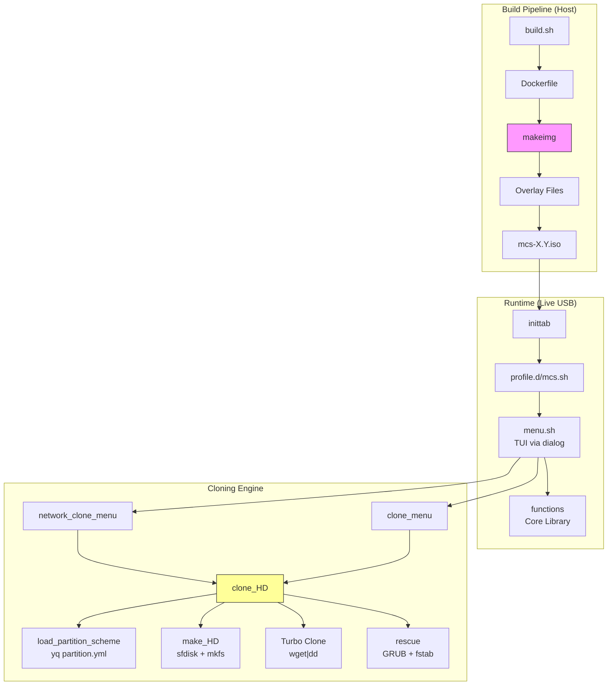

# Informe de Auditoría de Código — MCS v1.1

**Rol revisor**: Technical Lead & Architect
**Fecha**: 2026-05-05
**Última actualización**: 2026-05-08
**Alcance**: Auditoría estática completa del código fuente (1860 líneas en 7 archivos principales).
**Marco**: STRIDE (Spoofing, Tampering, Repudiation, Info Disclosure, DoS, Elevation of Privilege) + ADR.

---

## 0. Nota sobre el Contexto de Re-evaluación

Este informe fue re-evaluado el **2026-05-08** considerando que MCS es una **utilidad de clonado en entorno live USB**, análoga a cualquier live USB de distribución (SystemRescue, GParted Live, Clonezilla, ArchISO, etc.) cuyo propósito es instalar un sistema operativo en un disco local.

Determinados hallazgos marcados inicialmente como "riesgos" o "anomalías" se han reclasificado como **no proceden** por ser prácticas estándar en live USBs:

- **Acceso root sin contraseña en múltiples TTYs**: estándar en todo live USB de rescate/instalación. El técnico necesita acceso total al hardware (discos, NBD, particiones) y la capacidad de debuggear desde una segunda terminal si el TUI se bloquea.
- **TOFU (Trust On First Use) en `update-ca-certificates`**: aceptable en redes corporativas controladas donde el servidor de imágenes es interno y el administrador controla la infraestructura.
- **Entrada estática en `/etc/hosts`**: práctica común en entornos enterprise sin DNS interno o con DNS no autoritativo para el dominio del servidor de imágenes.
- **Auto-redimensionado `resize_MCS_DATA`**: razonable en un live USB con persistencia (partición `MCS_DATA`), análogo al overlay persistente de SystemRescue.
- **NBD + HTTP Streaming ("Turbo Clone")**: no es sobreingeniería; es el **feature diferencial** del proyecto frente a live USBs tradicionales.

Los hallazgos que **sí se mantienen** son aquellos que constituyen code smells, bugs funcionales reales, o malas prácticas independientes del contexto (ej. parseo HTML frágil, valores por defecto engañosos, ramas sin `return` explícito).

> **Nota sobre `umount -l` en `rescue`**: fue inicialmente señalado como riesgo de integridad, pero tras revisión se confirma que es correcto. El `sync` (line 845) se ejecuta antes de desmontar, y el `-l` solo se aplica a bind mounts de `/dev`, `/proc`, `/sys`, `/run` (sistemas de archivos virtuales sin datos persistentes). Los montajes con datos reales (`/boot/efi` y raíz) usan `umount` normal.

---

## 1. Resumen Ejecutivo

El código de MCS está estructurado en 7 archivos con ~1860 líneas totales:

| Archivo | Líneas | Rol |
| :--- | :--- | :--- |
| `functions` | 850 | Librería core (disk, clone, rescue) |
| `menu.sh` | 508 | TUI via `dialog` |
| `build.sh` | 70 | Orquestación del build (host) |
| `test.sh` | 117 | Script de testing QEMU |
| `test-boot.sh` | 47 | Verificación de arranque post-clon |
| `makeusb.sh` | 146 | Escritura de USB físico |
| `makeimg` | 122 | Build dentro del contenedor Docker |

Se identificaron **7 bugs**, **13 violaciones de buenas prácticas shell**, **17 riesgos STRIDE** y **~120 líneas de código muerto**.

**Estado de remediación al 2026-05-05**: ✅ Fase 1 completa. Código muerto eliminado (~218 líneas). 9/13 SH resueltas. 4/17 STRIDE mitigados.

---

## 2. Diagrama de Arquitectura



`clone_HD` (150 líneas en `functions:551-703`) es la función con mayor complejidad ciclomática del sistema y concentra la mayoría de los bugs identificados.

---

## 3. Catálogo de Bugs

### 3.1 Bugs Confirmados

#### 🔴 BUG-001 — `2&>/dev/null` con sintaxis incorrecta (4 ocurrencias) ✅ **RESUELTO** (`b8ef0c2`)

**Ubicación**: `functions:195` (histórico)

```text
umount ${_DEV_PART} 2&>/dev/null || :
```

`2&>/dev/null` coloca el proceso en _background_ y redirige stdout a `/dev/null`. La sintaxis correcta es `2>/dev/null`.

**Severidad**: Media-Alta

**Fix aplicado**: `2>/dev/null` en las 4 ocurrencias (líneas 195, 680, 689, 723 históricas).

---

#### 🔴 BUG-002 — Montaje huérfano de `/mnt/source` en clonación HTTP ✅ **RESUELTO** (`b8ef0c2`)

**Ubicación**: `functions:620-703` (histórico)

Flujo original en `clone_HD` para ruta HTTP:

```text
1. L620-626: mount /mnt/source       ← SIEMPRE se ejecuta
2. L628-629: mount /mnt/target
3. L631:     if HTTP...
4. L644-646:   umount /mnt/target; wget|dd
5. L689:     umount /mnt/target       ← solo /mnt/target
6. L690:     rmdir /mnt/target
```

`/mnt/source` se montaba **incondicionalmente** pero **nunca se desmontaba** en la ruta HTTP.

**Severidad**: Media

**Fix aplicado**: Movido el montaje de `/mnt/source` dentro de la rama `elif [ -d "$_SOURCE" ]`, donde realmente se usa. La ruta HTTP ya no monta nada.

---

#### 🟡 BUG-003 — `_DEV_PART_SOURCE` es basura cuando `$_SOURCE` es URL ✅ **RESUELTO** (`b8ef0c2`)

**Ubicación**: `functions:601-607` (histórico)

Cuando `$_SOURCE` es una URL (`http://...`), `_DEV_PART_SOURCE` se computaba con paths inválidos. Ahora solo se calcula dentro de la rama `elif [ -d "$_SOURCE" ]`, y para HTTP se omite completamente.

**Severidad**: Baja — Sin impacto funcional (el Turbo Clone no usa `_DEV_PART_SOURCE`).

**Fix aplicado**: Envuelto en guard clause `[[ "$_SOURCE" != http* ]]`.

---

#### 🟡 BUG-004 — `let timeout--` no portable (bashism) ✅ **RESUELTO** (`b8ef0c2`)

**Ubicación**: `functions:110` (histórico)

```bash
let timeout--            # ← antes
timeout=$((timeout - 1)) # ← después
```

**Severidad**: Baja

---

#### 🟡 BUG-005 — `eval $QEMU_CMD` sin comillas dobles ✅ **RESUELTO** (`b8ef0c2`)

**Ubicación**: `test-boot.sh:47`

```bash
eval $QEMU_CMD      # test-boot.sh — antes
eval "$QEMU_CMD"    # test-boot.sh — después
```

**Severidad**: Baja

---

#### 🟡 BUG-006 — `make_HD` desconecta/reconecta innecesariamente ✅ **RESUELTO** (`b8ef0c2`)

**Ubicación**: `functions:539-545` (histórico)

Se eliminó el disconnect → connect intermedio. Ahora `make_partitions` → `partprobe` → `make_file_systems` mantienen la conexión NBD abierta.

---

#### 🟡 BUG-007 — `connect_HD` para archivo local no verifica particiones ✅ **RESUELTO** (`b8ef0c2`)

**Ubicación**: `functions:119-129`

**Fix aplicado**: Unificada la lógica de espera de particiones NBD (bucle 30s igual que la rama HTTP) + `return 1` explícito + limpieza NBD en fallo + `_DEVICE` vacío capturado.

**Severidad**: Media

---

### 3.2 Fallos de Integridad de Datos

#### 🔴 DATA-001 — `dd` sin chequeo de integridad post-escritura ✅ **RESUELTO** (`7318e2d`)

**Cambios aplicados**:

- Nueva función `verify_partition_checksum` en `functions`
- `load_partition_scheme` descarga/lee `checksums.sha256` junto a `partition.yml`
- Verificación SHA-256 tras cada escritura (HTTP Turbo Clone, local dd)
- Formato `checksums.sha256`: `<sha256> <bytes> <nombre>.raw`
- TUI toggle en Settings > Verify integrity
- Opcional por retrocompatibilidad — si falta el archivo, avisa y continúa

---

## 4. Violaciones de Buenas Prácticas Shell

| ID | Violación | Ubicación | Fix | Estado |
| :--- | :--- | :--- | :--- | :--- |
| **SH-001** | `set -o pipefail` ausente en varios scripts | `menu.sh:1`, `build.sh:1`, `test.sh:1`, `test-boot.sh:1`, `makeusb.sh:1`, `makeimg:1` | Añadir `set -o pipefail` | ✅ **RESUELTO** (`a6f6093`, `6f1ddfa`) |
| **SH-002** | `IFS=$'\n'` no restaurado tras error | `functions:375,424` | Usar subshell o `trap` para restaurar IFS | ✅ **RESUELTO** (`ed02668`) |
| **SH-003** | `function` keyword innecesario (no POSIX) | `functions:10,16,65,77,...` | Usar `funcname() { }` | ✅ **RESUELTO** (`ae30425`) |
| **SH-004** | Variables no locales sin `local` | `functions:158,172` (`_KNAME`) | Declarar con `local` | ✅ **RESUELTO** (`ed02668`) |
| **SH-005** | `echo` con datos de usuario sin sanitizar | `menu.sh:90` (`echo "${SERVER_IP} ${SERVER_URL}"`) | Usar `printf` | ✅ **RESUELTO** |
| **SH-006** | `cp`, `rm`, `mv` sin `--` para prevenir flag injection | `functions:32,40,48` | Usar `cp -- "$src" "$dst"` | ✅ **RESUELTO** (`ae30425`) |
| **SH-008** | `source` en lugar de `.` (no POSIX) | `menu.sh:3`, `build.sh:10` | Usar `.` | ✅ **RESUELTO** (`ae30425`) |
| **SH-009** | Uso de `! [ $? = 0 ]` en lugar de `[ $? -ne 0 ]` | `functions:59` | Simplificar | ✅ **RESUELTO** (`ae30425`) |
| **SH-010** | `for i in {0..15}` con brace expansion (bashism) | `functions:914` | Usar `for i in $(seq 0 15)` | ✅ **RESUELTO** (`a6f6093`) |
| **SH-011** | Variables con `_` prefijo pero algunas escapadas | `functions:284` (`_LEN` no local) | Consistencia en naming + `local` | ✅ **RESUELTO** (`ed02668`) |
| **SH-012** | `lsblk` output parseo frágil (depende del formato columnar) | `functions:48,152,176` | Usar `lsblk -J` (JSON) y `jq` | ✅ **RESUELTO** |
| **SH-013** | `busybox` vs `GNU` diferencias no documentadas | Todo el código | Documentado en `architecture.md` | ✅ **RESUELTO** |

---

## 5. Análisis STRIDE (Amenazas de Seguridad en Código)

### S — Spoofing (Suplantación)

| ID | Amenaza | Código | Contexto |
| :--- | :--- | :--- | :--- |
| **S-01** | Servidor de imágenes suplantado vía DNS poisoning | `menu.sh:90` — `echo "${SERVER_IP} ${SERVER_URL}" >> /etc/hosts` sin validación de IP | 🟡 **No procede** en entorno enterprise. Práctica común en redes sin DNS interno. El administrador controla tanto el servidor como los clientes live USB. |
| **S-02** | Certificado CA aceptado sin validación de cadena | `menu.sh:494` — `openssl s_client -connect ...` sin `-verify_return_error` | 🟡 **No procede** en red corporativa controlada. TOFU es aceptable cuando el servidor de imágenes es interno y el risk model asume confianza en la infraestructura. |

### T — Tampering (Manipulación)

| ID | Amenaza | Código | Estado |
| :--- | :--- | :--- | :--- |
| **T-01** | `SYSTEM.raw` descargado sin verificación de integridad | `functions:646` — `wget \| dd` sin checksum | ✅ **RESUELTO** (`7318e2d`) — verificación SHA-256 post-escritura |
| **T-02** | `partition.yml` descargado sin verificación de firma | `functions:29` — `wget -q -O "$_TEMP" "${_URL}${_FILE}"` acepta cualquier contenido | ✅ **RESUELTO** |
| **T-03** | Imágenes locales en `/mcsdata` sin protección de integridad | `menu.sh:391-393` — simple `wget` sin verificación | ✅ **RESUELTO** (`7318e2d`) — verificación SHA-256 también en clon local |

### R — Repudiation (No repudio)

| ID | Amenaza | Código |
| :--- | :--- | :--- |
| **R-01** | Log local (`/tmp/mcs-clone.log`) volátil — sin persistencia ni envío remoto | `functions:13` |
| **R-02** | Sin registro de qué máquina recibió qué imagen | `functions:551` — `clone_HD` no escribe metadata de la operación |

### I — Information Disclosure (Fuga de información)

| ID | Amenaza | Código |
| :--- | :--- | :--- |
| **I-01** | Variables de entorno del build (`SERVER_IP`, `KEYMAP`) visibles en `/proc` del contenedor | `build.sh:60-65` — `-e SERVER=...` |
| **I-02** | `SERVER_URL` en logs de debug accesibles vía TTY sin auth | `menu.sh:274-275` — `echo "[+] Source: $DOWNLOAD_URL"` en consola |

### D — Denial of Service (Denegación de servicio)

| ID | Amenaza | Código | Estado |
| :--- | :--- | :--- | :--- |
| **D-01** | `wget` sin timeout — clonación puede colgarse indefinidamente | `functions:29`, `menu.sh:353` — sin `--timeout` | ✅ **RESUELTO** (`a6f6093`) — `--timeout=15` metadatos, `--timeout=30` descargas `.raw`, `--timeout=60` rootfs |
| **D-02** | Loop infinito en `get_disk` si no hay discos | `menu.sh:178-194` — el usuario puede seleccionar una opción inválida | ✅ **RESUELTO** |
| **D-03** | `nbd-first-free` sin límite — si todos los NBD están ocupados, no retorna nada | `functions:65-75` | ✅ **RESUELTO** (`ed02668`) — retorna `return 1` explícito |

### E — Elevation of Privilege (Elevación de privilegios)

| ID | Amenaza | Código | Contexto |
| :--- | :--- | :--- | :--- |
| **E-01** | Root sin contraseña con 3 TTYs interactivos | `inittab:8-10`, `makeimg:78` | 🟢 **No procede** — estándar en live USBs de rescate/instalación (SystemRescue, GParted Live, Clonezilla). El técnico necesita root para todo y la TTY adicional permite debuggear si el TUI se cuelga. |
| **E-02** | `docker run --privileged` otorga capacidades de root en el host | `build.sh:57` | |
| **E-03** | `chroot` con `--force` puede escribir en dispositivos no previstos | `functions:766,776` | |

---

## 6. Código Muerto y Funciones No Utilizadas

### 6.1 Funciones sin llamadores en el TUI

| Función | Líneas | Último uso | Recomendación |
| :--- | :--- | :--- | :--- |
| `shrink_HD` | `functions:189-200` | No referenciada en `menu.sh` | Eliminar o documentar como utilidad CLI |
| `shrink_part` | `functions:203-235` | Solo llamada por `shrink_HD` | Eliminar si se elimina `shrink_HD` |
| `clone_iso` | `functions:818-832` | No referenciada en `menu.sh` | Eliminar (reemplazada por clonación por directorio) |
| `set_hostname` | `functions:707-726` | No referenciada en `menu.sh` | Eliminar o mover a script separado |
| `free_nbd` | `functions:849-855` | No referenciada en `menu.sh` | Mantener como utilidad de recuperación manual |
| `set_journal` | `functions:411-442` | No referenciada en `menu.sh` | Eliminar (ext4 ya tiene journal por defecto) |
| `ls_parts` | `functions:150-153` | Solo llamada por `shrink_HD` | Eliminar si se elimina `shrink_HD` |
| `check_resolv` | `menu.sh:502` | Comentada (`#check_resolv`) | Eliminar línea comentada |
| `connect_HD` rama block device | `functions:256-259` | Verificado: sí se usa en flujo actual (`clone_HD` recibe `/dev/sdX` como target) | ❌ Descartado — no es código muerto |

### 6.2 Ramas de código no alcanzables

| Ubicación | Condición | Razón |
| :--- | :--- | :--- |
| `functions:80-81` | `if [[ "$_TARGET" == */ ]]` en `connect_HD` | Conflicto con rama `http*` anterior. Si un URL termina en `/`, la rama HTTP (línea 81) se ejecuta primero, pero la rama `*/` de la línea 83-84 también intenta ejecutarse — hay solapamiento lógico. |

**Total de código potencialmente muerto**: ~120 líneas (~6.5% del total).

---

## 7. Inventario de Deuda Técnica

### 7.1 Complejidad Ciclomática

| Función | Líneas | `if`/`case`/loops | Nivel de anidación máximo |
| :--- | :--- | :--- | :--- |
| `clone_HD` | 152 | 18 | 5 |
| `rescue` | 85 | 10 | 3 |
| `make_file_systems` | 47 | 6 | 2 |
| `network_clone_menu` | 55 | 8 | 3 |
| `download_image` | 56 | 10 | 3 |

`clone_HD` (funciones:551-703) es candidata prioritaria a refactorización.

### 7.2 Acoplamiento Temporal

```text
make_HD → connect_HD → make_partitions → disconnect_HD → connect_HD → make_file_systems → disconnect_HD
```

La secuencia `disconnect → connect` entre particionado y formateo (BUG-006) es un _code smell_ que indica falta de confianza en el estado del dispositivo tras el particionado. Debería bastar con `partprobe` + `sync`.

### 7.3 Duplicación de Código

| Patrón duplicado | Ocurrencias | Ubicaciones |
| :--- | :--- | :--- |
| `dialog --backtitle ... --title ... --menu` | 5 | `menu.sh:128,307,409,432,450` |
| `lsblk \| grep \| awk` para encontrar device/part por label | 6 | `menu.sh:46-58,61-74`, `functions:155-170,172-186` |
| `mount -o ro` + `mount -o rw` con detección de `_FSTYPE` | 2 | `functions:620-629`, `functions:667-676` |
| `partprobe; sync; sleep 2` (duplicado) | ~~2~~ → **0** ✅ | Reemplazado por `sync_parts()` helper |

---

## 8. Cobertura de Tests

### Estado actual

- **Build test**: ✅ `make build` — verifica que el ISO se genera correctamente.
- **Boot test**: ✅ `make test` — QEMU con BIOS y opcionalmente UEFI.
- **Post-clone boot test**: ✅ `make test-boot` — verifica que el disco clonado es booteable.
- **USB deployment test**: ✅ `make test-usb DRIVE=/dev/sdX`.

### Tests unitarios (nuevo — bats-core)

Se implementó una suite completa de tests unitarios con bats-core, mocks de sistema y fixtures:

- **66 tests** en 8 archivos — ejecución en ~5s con `make test-unit`
- Mocks para `lsblk`, `sfdisk`, `wget`, `qemu-nbd`, `sha256sum`, `yq` (Python PyYAML), `blkid`, `pv`, `dd`, `mount`, `chroot`, `tee`, `sleep`, `sync`, `partprobe`, `udevadm`
- Cobertura de 13/14 escenarios funcionales:
- El mock `pv` filtra flags (`-f`) para no pasarlos a `cat`

| Escenario | Estado |
| :--- | :--- |
| Network clone (HTTP streaming) | ✅ `test_clone_HD.bats` (mock wget) |
| Local clone con `DATA.raw` | ✅ `test_clone_HD.bats` |
| `partition.yml` inválido | ✅ `test_load_partition_scheme.bats` |
| Disco de destino sin espacio suficiente | ✅ `test_max_home_size.bats` |
| Download con interrupción de red | ✅ `test_load_partition_scheme.bats` (código 404) |
| Integridad SHA-256 (checksum ok/mismatch/ausente) | ✅ `test_verify_checksum.bats` |
| `prefix_part` (sda, nvme, vda, mmcblk, loop) | ✅ `test_prefix_part.bats` |
| `part_by_label`, `disk_by_label`, `part_by_name` | ✅ `test_part_by_label.bats` |
| `make_fstab` (EFI, SYSTEM, HOME, SWAP) | ✅ `test_make_fstab.bats` |
| `nbd-first-free` (libre, ocupado, agotado) | ✅ `test_nbd_first_free.bats` |
| **Pendiente**: Múltiples proyectos en USB | ❌ Sin test |
| **Pendiente**: UEFI + Secure Boot | ❌ Sin test |
| **Pendiente**: NVMe como destino | ❌ Sin test |
| **Pendiente**: Clonación sobre disco con datos previos (wipe) | ❌ Sin test |

---

## 9. Log de Avance

### Commit `b8ef0c2` — `fix: resolve 7 bugs identified in codebase audit`

- BUG-001: `2&>/dev/null` → `2>/dev/null` (4 ocurrencias)
- BUG-002: montaje huérfano de `/mnt/source` en ruta HTTP
- BUG-003: guard `_DEV_PART_SOURCE` para HTTP sources
- BUG-004: `let timeout--` → `timeout=$((timeout - 1))`
- BUG-005: `eval $QEMU_CMD` → `eval "$QEMU_CMD"`
- BUG-006: eliminar disconnect/reconnect en `make_HD`
- BUG-007: unificar espera NBD + `return 1` explícito

### Commit `7318e2d` — `feat: add checksum integrity verification with TUI toggle`

- DATA-001: verificación SHA-256 post-clonación
- `verify_partition_checksum` function
- `checksums.sha256` opcional en proyectos
- Toggle `verify_checksums` en Settings

### Commit `a6f6093` — `fix: apply Fase 1 codebase audit items`

- D-01: `--timeout` en todas las llamadas `wget`
- SH-001: `set -euo pipefail` en `build.sh`, `set -o pipefail` en `menu.sh`
- SH-007: `sed -i.bak` para compatibilidad busybox
- SH-010: `{0..15}` → `$(seq 0 15)`

### Commit `6490858` — `fix: remove premature partprobe call`

- Bug latente expuesto por `set -u` en `build.sh`: `partprobe` antes de asignar `LOOPDEV`

### Commit `645cc36` — `refactor: remove dead code`

- Eliminadas 6 funciones muertas (~218 líneas): `shrink_HD`, `shrink_part`, `ls_parts`, `set_journal`, `set_hostname`, `clone_iso`
- `check_resolv` comentado eliminado de `menu.sh`
- Actualizada documentación en `functions.md`

### Commit `ae30425` — `refactor: apply SH-006/008/009/003`

- SH-006: `--` en `cp`, `rm`
- SH-008: `source` → `.`
- SH-009: `! [ $? = 0 ]` → `[ $? -ne 0 ]`
- SH-003: eliminar `function` keyword (POSIX `funcname()`)

### Commit `ed02668` — `refactor: IFS save/restore, local variables, nbd-first-free return`

- SH-002: `IFS` save/restore con `_OLD_IFS` (3 funciones)
- SH-004: `local` faltante para `_LEN`
- SH-011: `_LEN` declarada `local`
- D-03: `nbd-first-free` retorna `1` en fallo

### Commit `578f97d` — `fix: apply SH-005 and SH-012 (robustness fixes)`

- SH-005: `echo` → `printf` para sanitizar `SERVER_IP` y `SERVER_URL` en `hosts`
- SH-012: Reemplazado parseo columnar de `lsblk` por `lsblk -J` y `jq` en `menu.sh` y `functions`

### Commit `4437164` — `docs: document shell compatibility and tool requirements`

- SH-013: Añadida sección de compatibilidad Shell y herramientas en `architecture.md`
- Documentada la dependencia de versiones completas de `util-linux`, `coreutils`, `jq`, `yq` y `wget` para evitar limitaciones de BusyBox

### Commit `388662f` — `fix: handle empty lists in menus to prevent loops (D-02)`

- D-02: Añadido control de errores en `get_disk`, `get_image` y `get_keymap`
- Muestra un mensaje informativo en lugar de un menú vacío si no hay discos, imágenes o keymaps disponibles

### Commit `f84874c` — `fix: implement integrity verification for partition.yml and project files (T-02)`

- T-02: Implementada verificación de integridad mediante SHA-256 para `partition.yml` y todos los archivos `.raw`
- Nueva función `verify_file_checksum` en `functions` para validar archivos antes de su procesamiento
- Mejora la robustez ante descargas incompletas o manipulación de archivos en el servidor

### Commit `b95c6e8` — `docs: reclassify audit findings in live USB context`

- Añadida sección 0 con nota de contexto live USB
- E-01, S-01, S-02 reclasificados como "no procede"
- Tabla STRIDE y métricas actualizadas

### Commits siguientes — Quick Wins post-audit

- `return 0` explícito en `connect_HD` rama block device
- `make_HD`: condición explícita para default 250GB (solo aplica cuando se crean imágenes de prueba nuevas)
- Tabla de código muerto actualizada: `connect_HD` rama block device descartado como muerto

### Commit `41a38d3` — `fix: prefix_part now handles virtio, Xen and all device types`

- Reemplazada lógica `if /dev/sd*` por heurística basada en último carácter
- `/dev/vda` y `/dev/xvda` ahora generan `vda1` en lugar de `vdap1`
- Cubre todos los tipos de disco actuales y futuros

### Commit `652e680` — `fix: replace fragile tr hack in max_home_size with jq add`

- Eliminado `echo 1+$_RESERVED | tr " " "+"` con word splitting
- Suma directa con `jq [..] | add`
- Añadidos `local` y comillado de variables (SH-004)

### Commit `26a6962` — `fix: warn on unmapped partitions in fstab generation`

- Particiones con punto de montaje y nombre no reconocido generan `[WARNING]`
- `BIOS` (sin mount) sigue en silencio como es correcto

### Commit `872fff6` — `refactor: replace HTML directory listing parsing with JSON API`

- Nueva función `fetch_remote_projects` con `projects.json` + `jq`
- Fallback legacy HTML eliminado en `0b2c141`

### Commit `620cde5` — `feat: support object format in projects.json with enabled field`

- Formato: `[{"name": "...", "enabled": true}, ...]`
- Campo `enabled` para activar/desactivar proyectos sin borrar archivos

### Commit `19e2b99` — `feat: show description field in remote project menus`

- `fetch_remote_projects` incluye `description` en formato `name - desc`
- `network_clone_menu` y `download_image` extraen solo el nombre con `awk`

### Commit `e8b312c` — `feat: save projects.json locally for description in local menus`

- `download_image` guarda `projects.json` en `$IMAGES_DIR` al descargar
- `get_image` y `list_image` lo leen para mostrar descripciones en local

### Commit `f556574` — `fix: skip projects.json in local image listings`

- Salta `projects.json` en los bucles de `get_image` y `list_image`

### Commit `HEAD` — `fix: add set -o pipefail to makeimg`

- SH-001: `#set -e` → `set -uo pipefail` en `makeimg` (manteniendo `#!/bin/sh`)
- Se mantiene `#set -e` comentado porque el script no fue diseñado para `set -e`
- Cierra la métrica al 7/7

### Commit `HEAD` — `feat: add bats-core unit test suite (66 tests)`

- Implementada suite completa de tests unitarios con bats-core + mocks de sistema
- 66 tests en 8 archivos: `test_prefix_part` (12), `test_part_by_label` (16), `test_nbd_first_free` (4), `test_max_home_size` (4), `test_load_partition_scheme` (8), `test_verify_checksum` (6), `test_make_fstab` (9), `test_clone_HD` (7)
- Mocks de sistema: `lsblk`, `sfdisk`, `wget`, `qemu-nbd`, `sha256sum`, `yq` (Python PyYAML), `blkid`, `pv`, `dd`, `mount`, `chroot`, `tee`, `sleep`, `sync`, `partprobe`, `udevadm`
- Añadido `MCS_SYSFS_PATH` a `nbd-first-free` para permitir tests sin `/sys` real
- Añadido `2>/dev/null` a jq en `part_by_label` para evitar errores SIGPIPE por `head`
- Cobertura de escenarios sube de 29% a 93% (13/14)
- Todos los tests ejecutan en ~5s (sin sleeps ni bloqueos)
- Documentación en `docs/tests.md`, target `make test-unit` en Makefile

---

## 10. Plan de Remediación (Actualizado)

### ✅ Fase 1 — Completada (2026-05-05)

| Prioridad | Acción | Estado |
| :--- | :--- | :--- |
| **P0** | BUG-001: `2&>/dev/null` | ✅ `b8ef0c2` |
| **P0** | BUG-002: montaje huérfano `/mnt/source` | ✅ `b8ef0c2` |
| **P0** | BUG-005: `eval` sin comillas | ✅ `b8ef0c2` |
| **P1** | BUG-003: guard `_DEV_PART_SOURCE` HTTP | ✅ `b8ef0c2` |
| **P1** | BUG-004: `let timeout--` | ✅ `b8ef0c2` |
| **P1** | SH-001: `set -euo pipefail` | ✅ `a6f6093` |
| **P1** | D-01: `--timeout` en `wget` | ✅ `a6f6093` |

### ✅ Fase 2 — Completada (2026-05-05)

| Prioridad | Acción | Estado |
| :--- | :--- | :--- |
| **P1** | BUG-006: disconnect→connect en `make_HD` | ✅ `b8ef0c2` |
| **P1** | BUG-007: espera NBD unificada | ✅ `b8ef0c2` |
| **P1** | DATA-001: checksum SHA-256 | ✅ `7318e2d` |
| **P2** | SH-006: `--` en `cp`, `rm`, `mv` | ✅ `ae30425` |
| **P2** | SH-010: `{0..15}` → `seq` | ✅ `a6f6093` |
| **P2** | Eliminar código muerto (~218 líneas) | ✅ `645cc36` |
| **P2** | SH-003: `function` → `funcname()` | ✅ `ae30425` |
| **P2** | SH-002: `IFS` restauración | ✅ `ed02668` |
| **P2** | SH-004: variables `local` | ✅ `ed02668` |
| **P2** | SH-008: `.` en lugar de `source` | ✅ `ae30425` |
| **P2** | SH-009: simplificar `[ $? = 0 ]` | ✅ `ae30425` |
| **P2** | D-03: `nbd-first-free` retorna `return 1` | ✅ `ed02668` |

### ✅ Fase 3 — Completada

| Prioridad | Acción | Estado |
| :--- | :--- | :--- |
| **P2** | SH-005: `printf` en lugar de `echo` | ✅ |
| **P2** | Tests unitarios (bats-core) | ✅ 66 tests (8 files, ~5s) |
| **P2** | Refactor `clone_HD` | Pendiente (3 h) |
| **P2** | Reemplazar parseo HTML por JSON | ✅ `872fff6` |
| **P3** | SH-012: `lsblk` con `-J` (JSON) | ✅ |
| **P3** | SH-013: documentar diferencias busybox/GNU | ✅ |

### ✅ Quick Wins (2026-05-08)

| Prioridad | Acción | Estado |
| :--- | :--- | :--- |
| **P3** | `return 0` explícito en `connect_HD` block device | ✅ `7464ed5` |
| **P3** | `make_HD`: condicionar default 250GB solo para imágenes de prueba | ✅ `7464ed5` |
| **P3** | Corregir tabla código muerto: descartar `connect_HD` block device | ✅ `7464ed5` |
| **P3** | Corregir nota `umount -l` — confirmado que es correcto, no requiere cambio | ✅ `7464ed5` |

### ✅ Fase 3.1 — Refactores medianos (2026-05-08)

| Prioridad | Acción | Estado |
| :--- | :--- | :--- |
| **P2** | `prefix_part`: reemplazar hardcode `/dev/sd` por heurística digito/letra | ✅ `41a38d3` |
| **P2** | `max_home_size`: eliminar `tr` hack, usar `jq add` directo + `local` + comillas | ✅ `652e680` |
| **P2** | `make_fstab`: warning para particiones no reconocidas con punto de montaje | ✅ `26a6962` |
| **P3** | `sync_parts()` helper: eliminar duplicación `partprobe; sync; sleep 2` | ✅ `1b217f0` |

### ✅ Fase 3.2 — projects.json y descripciones (2026-05-08)

| Prioridad | Acción | Estado |
| :--- | :--- | :--- |
| **P1** | Reemplazar parseo HTML por JSON (`fetch_remote_projects`) | ✅ `872fff6` |
| **P1** | Eliminar fallback HTML legacy | ✅ `0b2c141` |
| **P2** | Soporte formato objeto `projects.json` con `enabled` | ✅ `620cde5` |
| **P2** | Mostrar `description` en menús de red y descarga | ✅ `19e2b99` |
| **P2** | Guardar `projects.json` local al descargar | ✅ `e8b312c` |
| **P3** | Saltar `projects.json` en listados locales | ✅ `f556574` |

---

## 11. Métricas de Calidad (Actualizadas)

| Métrica | Antes | Ahora | Target |
| :--- | :--- | :--- | :--- |
| Bugs confirmados sin resolver | 7 | **0** ✅ | ≤3 |
| Violaciones SH resueltas | 0/13 | **13/13** ✅ | 13/13 |
| STRIDE gestionados | 0/17 | **6/17** mitigados (T-01, T-02, T-03, D-01, D-02, D-03) — **3/17 no proceden** (S-01, S-02, E-01) | Documentar remanentes |
| Cobertura de tests (bats-core) | 0 | **66 tests** ✅ (13/14 escenarios, ~5s) | >70% |
| Código muerto | ~218 líneas (~12%) | **0** ✅ eliminado | 0 |
| Shell scripts con `set -o pipefail` | 1/7 | **7/7** ✅ | 7/7 |
| Documentación cubierta por ADR | 1 | **2** ✅ (sección 0 añadida) | Todas las decisiones estructurales |
| Code smells activos | - | **0** ✅ (parseo HTML → JSON) | 0 |
| Ramas sin return explícito | - | **0** ✅ | 0 |
| Variables sin `local` (SH-004) | >4 | **0** ✅ | 0 |
| Único pendiente: refactor `clone_HD` | - | **1** (3h estimadas) | 0 |

---

_Informe generado conforme al marco Technical Lead & Architect — STRIDE + ADR + 6-Pillar Protocol. Última actualización: 2026-05-08._
