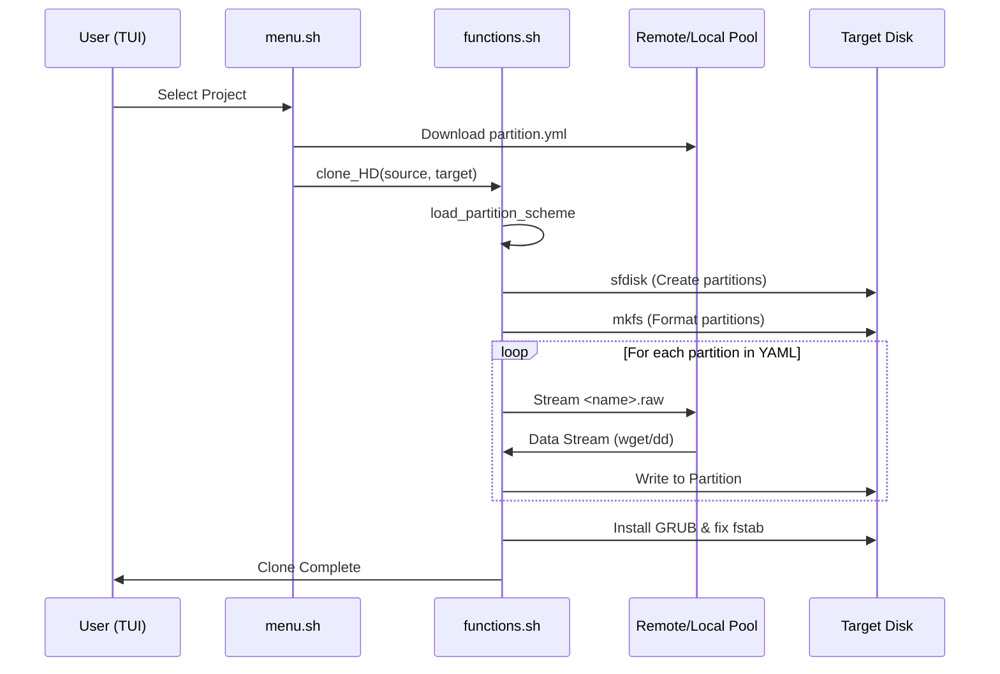

# Disk Partitioning Guide

The Migasfree Clone System (MCS) uses a dynamic partitioning engine driven by a project-specific configuration file.



## 📀 The `partition.yml` file

Every project in MCS **must** include a `partition.yml` file. This file defines the exact layout of the target disk, including partition sizes, filesystems, and mount points.

### Location

The system looks for this file in the following order:

1. **Network Clone**: `http://<SERVER_URL>/pool/mcs/<PROJECT_NAME>/partition.yml`
2. **Local USB Clone**: `/mcsdata/pool/mcs/<PROJECT_NAME>/partition.yml`

---

## 🛠 Syntax

The file uses YAML format and must contain a `partitions` list.

```yaml
# MCS Partition Definition
# Sizes are in MB. 
# Type GUIDs for GPT:
# - EFI: C12A7328-F81F-11D2-BA4B-00A0C93EC93B
# - BIOS: 21686148-6449-6E6F-744E-656564454649
# - SWAP: 0657FD6D-A4AB-43C4-84E5-0933C84B4F4F
# - Linux: 0FC63DAF-8483-4772-8E79-3D69D8477DE4

partitions:
  - number: 1
    name: "EFI"
    size: 512
    type: "C12A7328-F81F-11D2-BA4B-00A0C93EC93B"
    filesystem: "vfat"
    mount: "/boot/efi"
  
  - number: 2
    name: "BIOS"
    size: 1
    type: "21686148-6449-6E6F-744E-656564454649"
    filesystem: "ext4"
    mount: "none"

  - number: 3
    name: "SWAP"
    size: 2048
    type: "0657FD6D-A4AB-43C4-84E5-0933C84B4F4F"
    filesystem: "swap"
    mount: "none"

  - number: 4
    name: "SYSTEM"
    size: 20480
    type: "0FC63DAF-8483-4772-8E79-3D69D8477DE4"
    filesystem: "ext4"
    mount: "/"

  - number: 5
    name: "HOME"
    size: 0  # 0 means use the rest of the disk
    type: "0FC63DAF-8483-4772-8E79-3D69D8477DE4"
    filesystem: "ext4"
    mount: "/home"
```

### Field Reference

| Field | Description | Example |
| :--- | :--- | :--- |
| `number` | Partition number on the disk (1-128). | `1`, `2` |
| `name` | Label for the partition and name of the `.raw` file to clone. | `"SYSTEM"`, `"HOME"` |
| `size` | Size in MB. Use `0` for the last partition to fill the remaining disk space. | `512`, `20480`, `0` |
| `type` | GPT Type GUID (standard identifiers). | `"0FC63DAF-8483-4772-8E79-3D69D8477DE4"` |
| `filesystem` | File system to create (`ext4`, `vfat`, `swap`). | `"ext4"`, `"vfat"` |
| `mount` | Mount point in the target system's `/etc/fstab`. | `"/"`, `"/home"`, `"none"` |

---

## 🔑 Common GPT Type GUIDs

When defining your partitions, use these standard GUIDs to ensure compatibility with UEFI and modern operating systems:

- **EFI System Partition (ESP)**: `C12A7328-F81F-11D2-BA4B-00A0C93EC93B`
- **BIOS Boot Partition**: `21686148-6449-6E6F-744E-656564454649`
- **Linux Filesystem**: `0FC63DAF-8483-4772-8E79-3D69D8477DE4`
- **Linux Swap**: `0657FD6D-A4AB-43C4-84E5-0933C84B4F4F`

---

## ⚙️ Advanced Behavior

### Cloning Logic

For each partition defined in the YAML, MCS follows this logic:

1. If the name is **structural** (`BIOS`, `EFI`, `SWAP`), it only creates and formats the partition.
2. For other names (like `SYSTEM` or `HOME`), it looks for a `<name>.raw` file in the source directory.
3. If the partition is named `HOME` and `HOME.raw` is missing, it will automatically fall back to `DATA.raw`.

### Dynamic Sizing

Setting `size: 0` is a powerful feature for deployment. It tells the MCS engine to calculate the disk geometry and extend that partition to use **100% of the remaining sectors**. This is typically used for the `/home` or `/data` partition to adapt to different physical disk sizes.

### FSTAB Generation

The system automatically generates the target `/etc/fstab` using the `mount` and `filesystem` fields. It uses **PARTUUID** for maximum reliability across different hardware.
